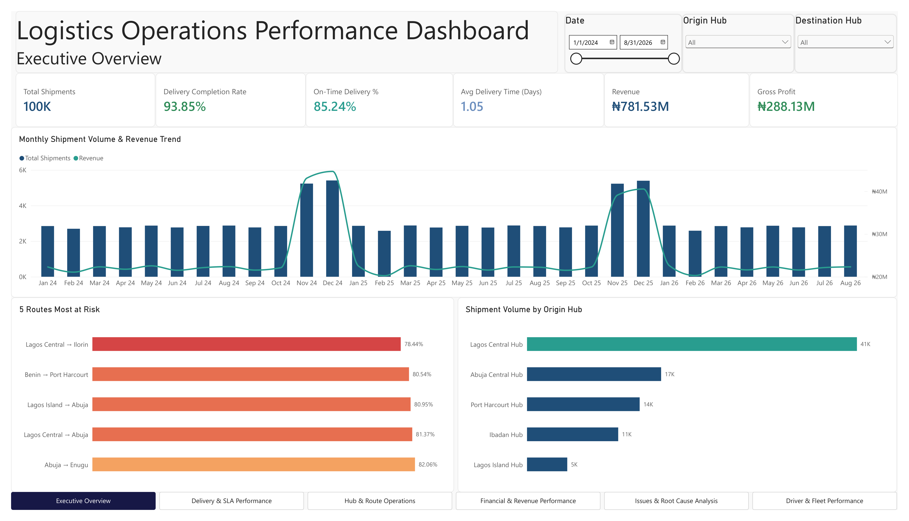
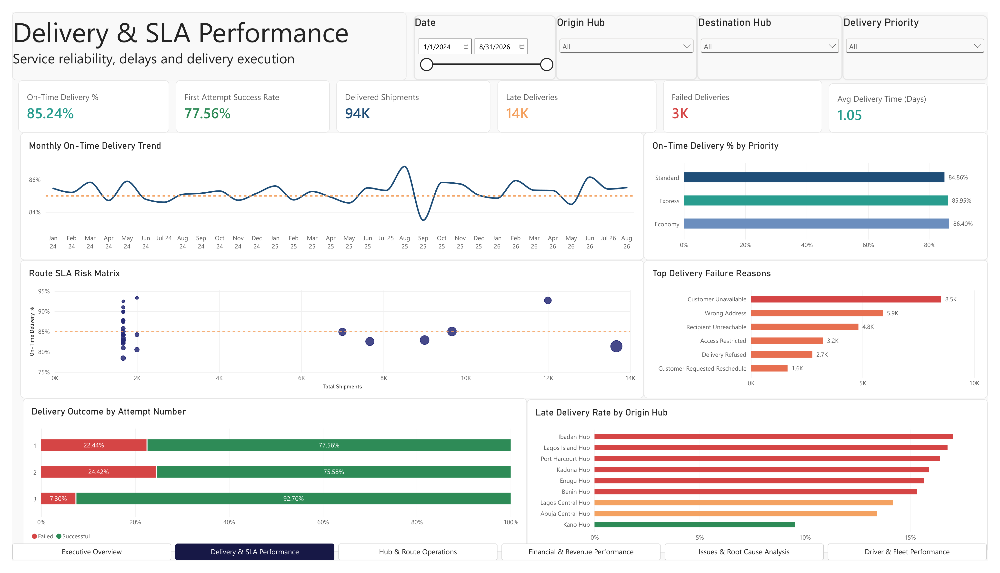
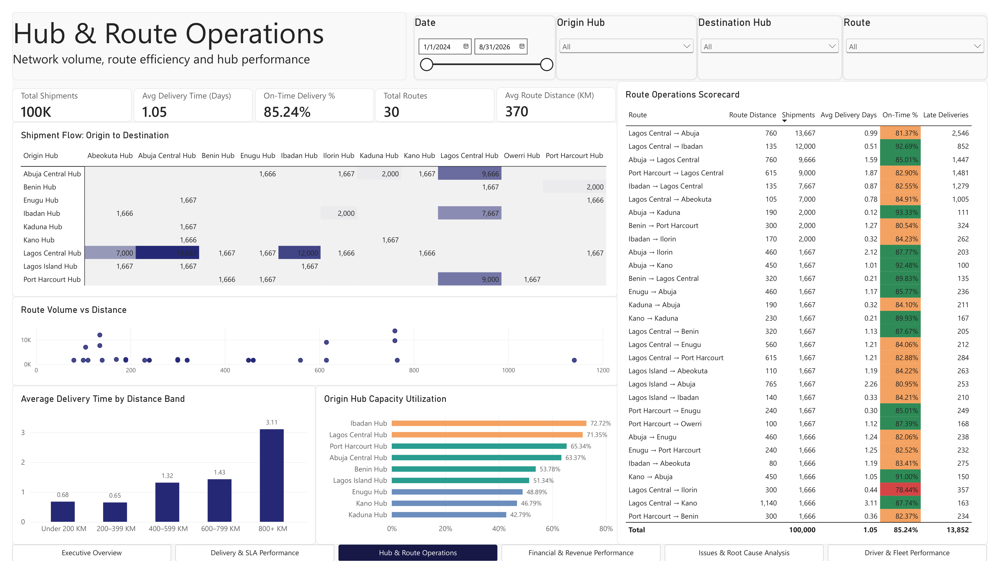
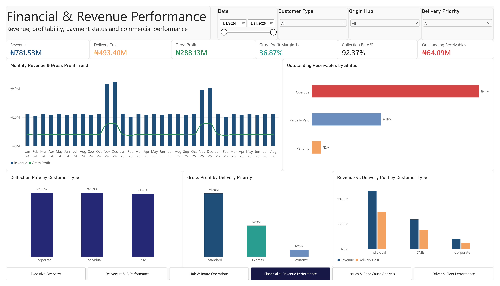
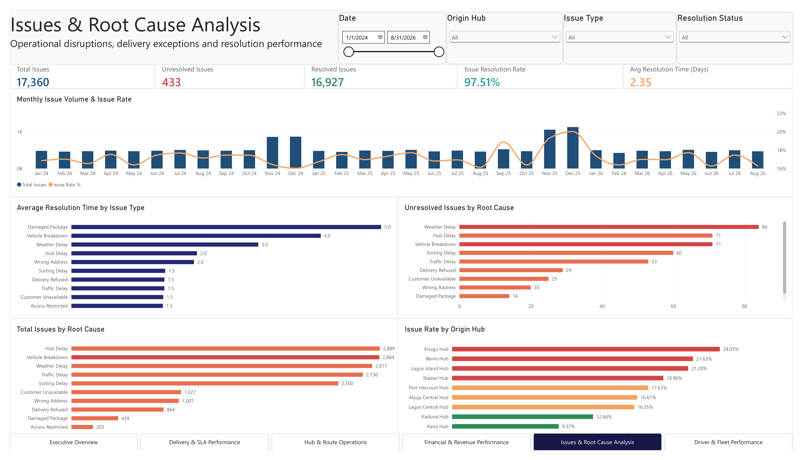
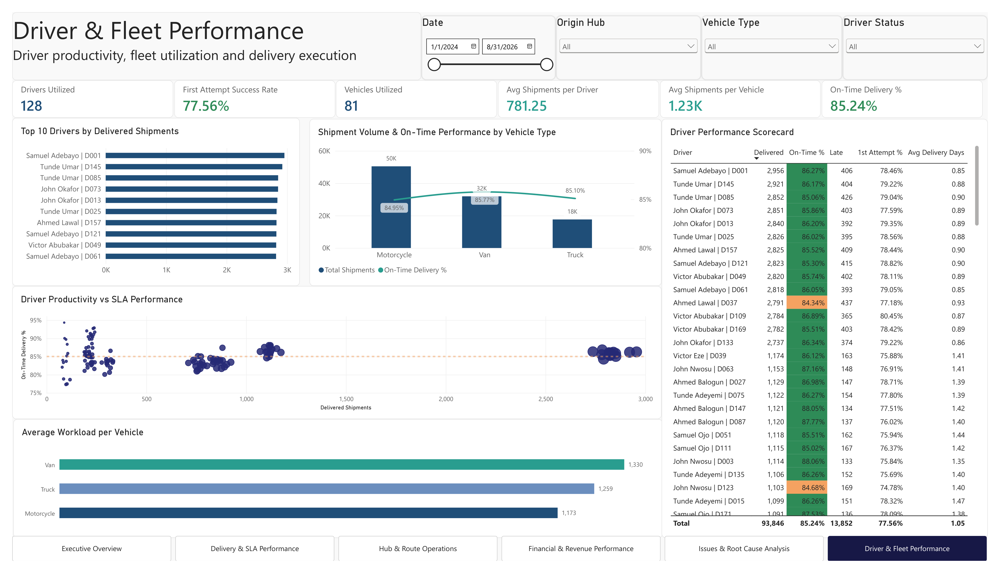

# Logistics Operations Performance Dashboard



## Project Overview

This project is an end-to-end logistics analytics solution built using **PostgreSQL and Power BI**.

The objective was to simulate a logistics company's operational environment and build an interactive reporting solution for monitoring delivery performance, route efficiency, hub operations, financial performance, operational issues, and fleet productivity.

The project covers the full analytics workflow:

- Relational database design
- Synthetic data generation
- Data quality validation and refinement
- SQL analysis
- Data modelling
- DAX measure development
- Dashboard design and visualization
- Business performance analysis

> **Note:** All data used in this project is synthetic and was generated solely for portfolio and analytical demonstration purposes.

---

## Tools & Technologies

- **PostgreSQL** — relational database design, data generation and data quality checks
- **SQL** — transformation, validation and analytical queries
- **Power BI** — data modelling, DAX, visualization and dashboard development
- **DAX** — KPI and performance metric calculations

---

## Dataset

The database contains 10 related tables representing a fictional logistics operation:

- Customers
- Hubs
- Drivers
- Vehicles
- Routes
- Shipments
- Tracking Events
- Delivery Attempts
- Shipment Issues
- Invoices

The final dataset contains **100,000 shipments** covering the period from **January 2024 to August 2026**.

---

## Data Model

The Power BI model connects shipment activity to operational and commercial dimensions including:

- Customers
- Routes
- Drivers
- Vehicles
- Origin hubs
- Destination hubs
- Delivery attempts
- Shipment issues
- Tracking events
- Invoices
- Date dimension

The model uses a primarily **star-schema-style structure**, with `shipments` serving as the central operational fact table.

---

## Key Performance Indicators

The dashboard tracks metrics including:

| KPI | Result |
|---|---:|
| Total Shipments | 100,000 |
| Delivery Completion Rate | 93.85% |
| On-Time Delivery | 85.24% |
| Average Delivery Time | 1.05 Days |
| First Attempt Success Rate | 77.56% |
| Late Deliveries | 13,852 |
| Revenue | ₦781.53M |
| Delivery Cost | ₦493.40M |
| Gross Profit | ₦288.13M |
| Gross Profit Margin | 36.87% |
| Collection Rate | 92.37% |
| Outstanding Receivables | ₦64.09M |
| Total Issues | 17,360 |
| Issue Resolution Rate | 97.51% |
| Drivers Utilized | 128 |
| Vehicles Utilized | 81 |

---

# Dashboard Pages

## 1. Executive Overview

Provides a high-level view of logistics performance including shipment volume, delivery performance, revenue, profitability, route risk and hub activity.


---

## 2. Delivery & SLA Performance

Focuses on service reliability and delivery execution.

Analysis includes:

- On-time delivery performance
- First-attempt delivery success
- Late deliveries
- Failed deliveries
- Delivery performance by priority
- Delivery failure reasons
- Route SLA performance
- Late-delivery rates by origin hub



---

## 3. Hub & Route Operations

Analyzes network activity and route efficiency.

Analysis includes:

- Origin-to-destination shipment flow
- Route distance and shipment volume
- Delivery time by distance band
- Hub capacity utilization
- Route-level SLA performance
- Late deliveries by route



---

## 4. Financial & Revenue Performance

Provides visibility into the commercial performance of logistics operations.

Analysis includes:

- Revenue
- Delivery cost
- Gross profit
- Gross margin
- Outstanding receivables
- Collection rate
- Customer-type profitability
- Delivery-priority profitability
- Monthly financial trends



---

## 5. Issues & Root Cause Analysis

Examines operational disruptions and issue-resolution performance.

Analysis includes:

- Total operational issues
- Issue rate
- Issue distribution by root cause
- Resolution rate
- Average resolution time
- Unresolved issues
- Issue rates by origin hub



---

## 6. Driver & Fleet Performance

Evaluates workforce productivity and fleet utilization.

Analysis includes:

- Drivers utilized
- Vehicles utilized
- Shipments per driver
- Shipments per vehicle
- Driver SLA performance
- First-attempt success
- Vehicle-type workload
- Driver performance scorecard



---

# Data Quality & Synthetic Data Refinement

During exploratory analysis, several artificial patterns were identified in the initially generated dataset.

Rather than hiding these patterns at the visualization layer, the underlying PostgreSQL data was refined.

Examples include:

### Route SLA Distribution
Delivery outcomes were redistributed using deterministic hash-based logic to create more realistic variation in route-level SLA performance.

### Delivery Attempts
Delivery attempts were rebuilt so that most successful deliveries occur on the first attempt while a smaller portion require second or third attempts.

### Failure Reasons
Failed-delivery reasons were weighted to produce a more realistic distribution across:

- Customer unavailable
- Wrong address
- Recipient unreachable
- Access restricted
- Delivery refused
- Customer-requested reschedule

### Shipment Issues
Issue types were redistributed to remove artificial patterns while retaining reproducibility.

### Resolution Times
Resolution times were adjusted according to issue severity. More complex issues such as damaged packages and vehicle breakdowns require longer resolution periods than simpler operational exceptions.

### Driver & Vehicle Utilization
Shipments were redistributed across active drivers and vehicles based on the route's origin hub to create more realistic workload patterns.

### Accounts Receivable
Invoice payment logic was refined to distinguish:

- Paid invoices
- Partially paid invoices
- Pending invoices
- Overdue invoices

This enabled realistic calculation of collection rate and outstanding receivables.

---

# SQL Scripts

The SQL folder contains the main scripts used to build and validate the project.

```text
sql/
├── 01_database_schema.sql
├── 02_data_generation.sql
└── 03_data_quality_fixes.sql
```

### `01_database_schema.sql`
Creates the relational PostgreSQL database structure.

### `02_data_generation.sql`
Generates the synthetic logistics dataset.

### `03_data_quality_fixes.sql`
Contains data validation checks and refinements applied after exploratory analysis.

---

# Repository Structure

```text
logistics-operations-performance-dashboard/
│
├── README.md
├── logistics_operations_performance_dashboard.pbix
├── logistics_operations_performance_dashboard.pdf
│
├── screenshots/
│   ├── 01_executive_overview.png
│   ├── 02_delivery_sla_performance.png
│   ├── 03_hub_route_operations.png
│   ├── 04_financial_revenue_performance.png
│   ├── 05_issues_root_cause_analysis.png
│   └── 06_driver_fleet_performance.png
│
└── sql/
    ├── 01_database_schema.sql
    ├── 02_data_generation.sql
    └── 03_data_quality_fixes.sql
```

---

# Power BI Files

The repository includes:

- **PBIX file** — interactive Power BI report
- **PDF report** — static six-page version of the completed dashboard

---

## Project Takeaways

This project demonstrates the ability to move beyond dashboard creation and work across the full analytics lifecycle:

**Database Design → Data Generation → Data Validation → SQL Analysis → Data Modelling → DAX → Visualization → Business Insights**

A major focus of the project was ensuring that the synthetic data behaved realistically enough to support meaningful operational analysis rather than simply producing visually appealing charts.

---

## Disclaimer

This project is a portfolio project.

All organizations, customers, drivers, shipments, financial values and operational records represented in the dataset are fictional and synthetically generated.
